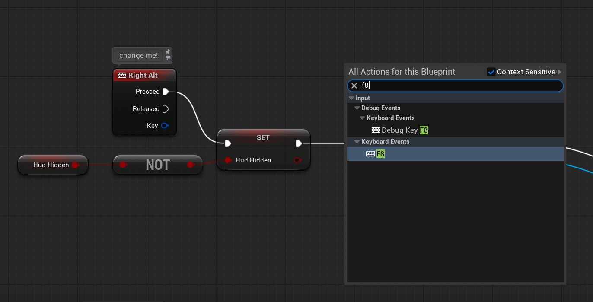

## what hides

all top-level widgets, meaning elements marked with `[top]` in the widget scan

the visibility change is instant & not based on a timer, unlike a fading one from [other mods](https://github.com/vahrina/hide-huds)

## config

there is no config file as the game was built with unreal engine 5. the mod serves as a blueprint (`ModActor`), so settings live in the blueprint themselves

the hotkey is `right alt`, if you want to change this please refer to [compiling it yourself](#changing-the-keybind)

## requirements

- [blueprint loader](https://www.nexusmods.com/minecraftdungeons2/mods/2)
- to build: unreal engine 5.6.x, `retoc.exe` & `repak.exe` from [here](https://www.nexusmods.com/minecraftdungeons2/mods/2?tab=files&file_id=24)

## building

run from `src/`:

```sh
python build_mod.py HideHud --install
```

running the above command will install it to the default location: `Dungeons/Content/Paks/~mods/HideHud`

if the game or engine is somewhere else, f.e.:

```sh
python build_mod.py HideHud --install --game "D:/Games/Minecraft Dungeons II" --engine "X:/UE_5.6"
```

> yes, windows paths use `\`, adjust it! looks ugly everywhere unfortunately

you may also omit every given flag & manually copy the built output from `src/Build/HideHud/` into  `Dungeons/Content/Paks/~mods`

## changing the keybind

1. inside ue 5.6.x (duh), open `Dungeons.uproject`
2. find the content browser (window > content browser) or in the bottom left, content drawer & open the `ModActor` blueprint
3. find the keyboard event in the top left, delete the node, right click on an empty space & type your preferred keybind in the prompt (as shown in the image below)
4. connect the `Pressed` exec pin to the exec input of the `SET` Hud Hidden node (tiny, white arrow on the left)
5. compile in the top left part of the window, then repeat [the build process](#building)


